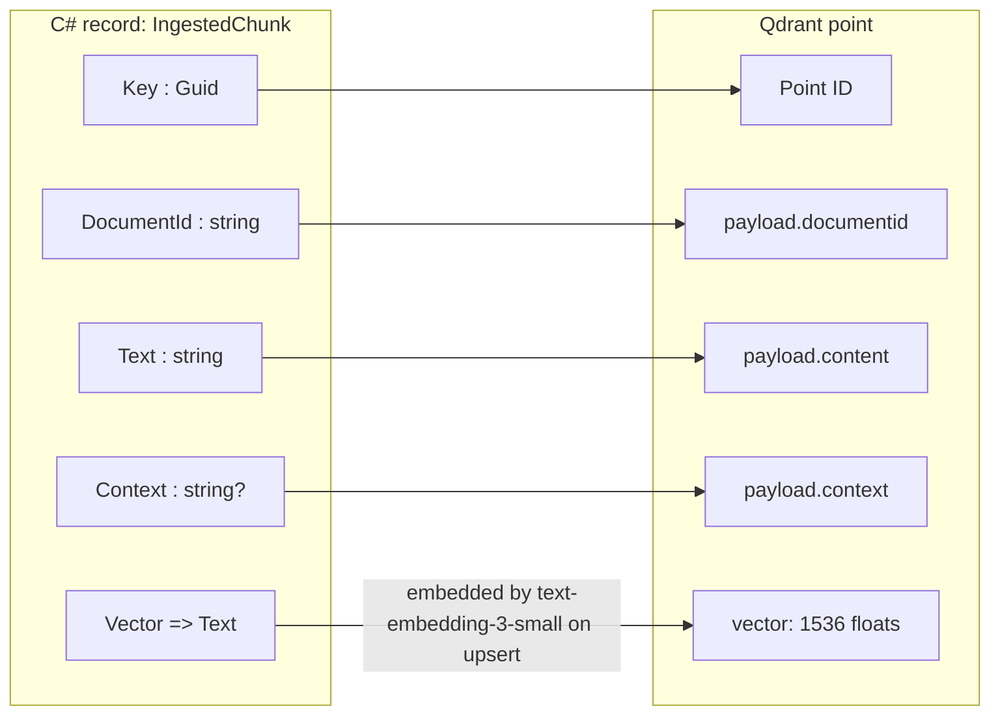
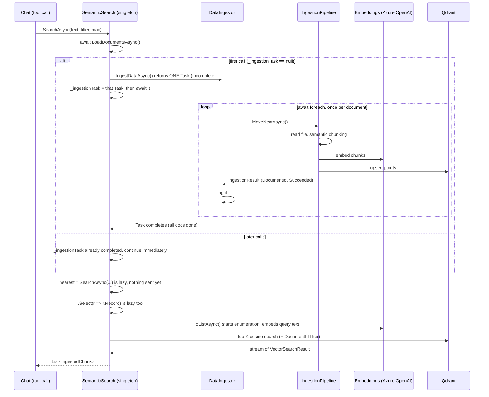
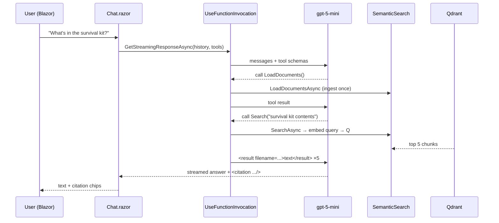
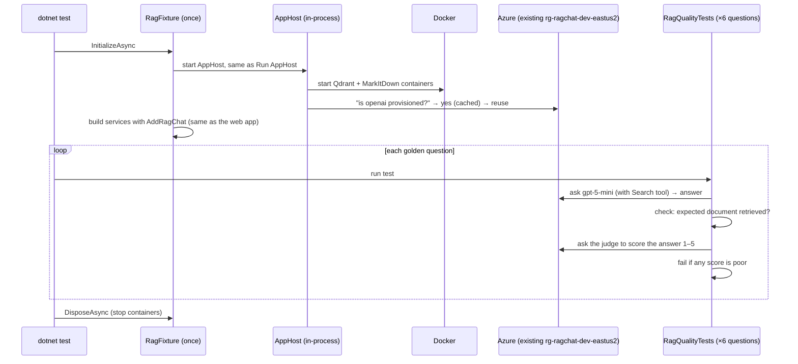
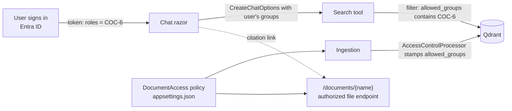
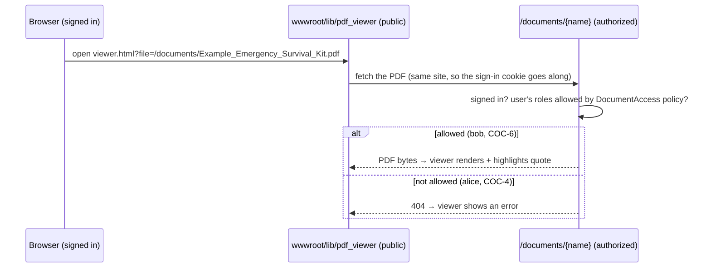
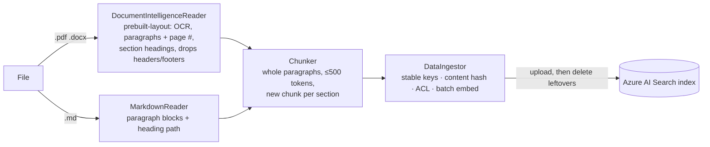
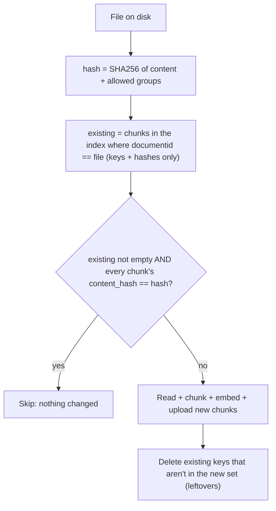
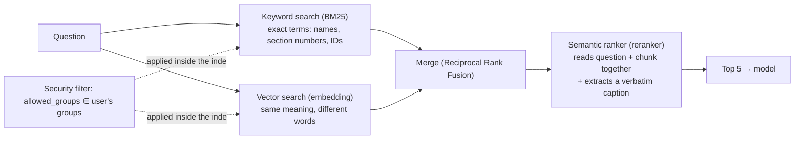
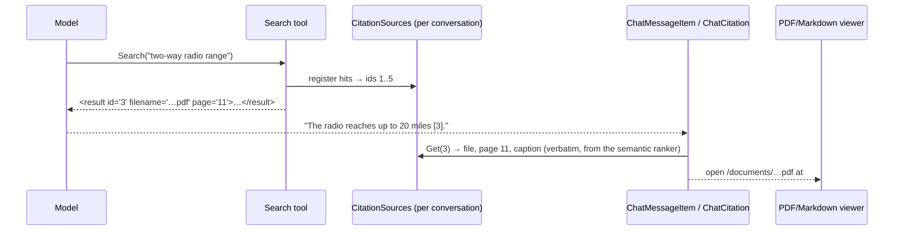

# AI Chat with Custom Data
This project is an AI chat application that demonstrates how to chat with custom data using an AI language model.  

It's a RAG (Retrieval-Augmented Generation) application that uses a vector database to store and retrieve information.
Simply put, LLMs can't access your company's information directly. RAG lets you share relevant documents with the LLM, 
so it can answer your questions using your own data. [Short summary](https://youtube.com/shorts/xS55duPS-Pw?si=9iAMDJ593p34ZAG6).

**Interview prep:** [docs/interview-prep.md](docs/interview-prep.md) covers model choices, chunk sizing, ServiceNow RAG design, and what a law-firm RAG needs.

## Helpful Links
- [Exploring the new AI chat template](https://andrewlock.net/exploring-the-new-ai-chat-template/)
- [Develop AI agents with Semantic Kernel - Jakob Ehn - NDC Oslo 2024](https://youtu.be/idH0dD7UiqE?si=QkDeUYVgmI-jDFnd)
- Watch this video first: [What is a Vector Database? Powering Semantic Search & AI Applications](https://youtu.be/gl1r1XV0SLw?si=o4pQks2d3kR9XLIo)
- https://github.com/Azure-Samples/ai-chat-aspire-meai-csharp

## Local Dev Setup
1. Install .NET 10 SDK
2. Install tools for Azure Dev in VSCode
   https://learn.microsoft.com/en-us/azure/azure-functions/functions-develop-vs-code?tabs=node-v4%2Cpython-v2%2Cisolated-process%2Cquick-create&pivots=programming-language-csharp
3. Install Aspire CLI
   ```bash
   brew install --cask microsoft/aspire/aspire
   ```
   - To update later, use `brew upgrade --cask aspire`.
     - `aspire update --self` also works
4. Install VS Code extensions
   - **C# Dev Kit** (`ms-dotnettools.csdevkit`)
   - **Aspire** (`microsoft-aspire.aspire-vscode`): runs or debugs the AppHost
   - **Markdown Preview Mermaid Support** (`bierner.markdown-mermaid`): renders the diagrams in this README.
5. Install Docker Desktop
   - Aspire runs Qdrant and the MarkItDown (PDF → Markdown) MCP server as containers, so Docker must be running before you start the app.
6. Install Azure Developer CLI
   https://learn.microsoft.com/en-us/azure/developer/azure-developer-cli/install-azd?tabs=winget-windows%2Cbrew-mac%2Cscript-linux&pivots=os-mac
   ```bash
   brew install azure/azd/azd
   ```
   - Aspire can sign in to Azure with your `azd auth login` session (`Azure:CredentialSource = AzureDeveloperCli`, see [local provisioning](https://aspire.dev/integrations/cloud/azure/local-provisioning/)).
7. Install Azure CLI ([docs](https://learn.microsoft.com/en-us/cli/azure/install-azure-cli-macos?view=azure-cli-latest))
   ```bash
   brew update && brew install azure-cli
   az bicep install
   ```
   - Why: Aspire turns Azure resources into Bicep and compiles it with the Bicep CLI before deploying. Without it, provisioning fails instantly at `Compiling ARM template -> Failed to Provision`.
   - The VS Code Bicep extension doesn't provide this; it only ships the language server (editor IntelliSense).
   - Optional tab completion in bash:
     ```bash
     echo 'source $(brew --prefix)/etc/bash_completion.d/az' >> ~/.bash_profile
     source ~/.bash_profile
     ```

## Basics

### `VectorStoreKey`, `VectorStoreData` and `VectorStoreVector`
Reference: https://learn.microsoft.com/en-us/dotnet/ai/vector-stores/how-to/build-vector-search-app?pivots=azure-openai#add-the-app-code

```csharp
using Microsoft.Extensions.VectorData;

namespace VectorDataAI;

internal class CloudService
{
    [VectorStoreKey] # This property uniquely identifies the record.
    public int Key { get; set; }

    [VectorStoreData] # My normal application data.
    public string Name { get; set; }

    [VectorStoreData] # My normal application data.
    public string Description { get; set; }

    # The Vector property stores an embedding, which in this example is an array-like sequence of 384 floating-point numbers.
    # The attribute says the vector has 384 dimensions and that cosine similarity should be used for comparison.
    [VectorStoreVector(
        dimensions: 384,
        DistanceFunction = DistanceFunction.CosineSimilarity)]
    public ReadOnlyMemory<float> Vector { get; set; }
}
```
- The attributes tell the `Microsoft.Extensions.VectorData` abstraction how each property should be treated.
- Notice that `Key`, `Data` and `Vector` are prefixed with `VectorStore`
- Conceptually, a record might look like below. That array has 384 numbers, but I've truncated it for brevity.
```
CloudService
-----------------------------------------------------------
Key          1
Name         "Azure App Service"
Description  "Build and host web apps in the cloud"
Vector       [0.018, -0.027, 0.041, ..., 0.009]
-----------------------------------------------------------
```
- A collection might look like this:
```
Vector Store Collection
┌─────┬───────────────────┬─────────────────────────┬───────────────┐
│ Key │ Name              │ Description             │ Vector        │
├─────┼───────────────────┼─────────────────────────┼───────────────┤
│ 1   │ Azure App Service │ Build and host web...   │ [0.1,...]     │
│ 2   │ Azure Functions   │ Run event-driven code.. │ [0.3,...]     │
│ 3   │ Azure Storage     │ Store files and data... │ [0.02,...]    │
└─────┴───────────────────┴─────────────────────────┴───────────────┘
```
- The `Description` gets sent to an embedding model to produce a vector representation of the text. The vector is stored in the `Vector` property.
```csharp
var service = new CloudService
{
    Key = 1,
    Name = "Azure Storage",
    Description = "Store files and other data in the cloud"
};

// Conceptual example
service.Vector = GenerateEmbedding(service.Description);
```
- Basically
```
Description
   │
   │ embedding model
   ▼
"Store files and data..."
   │
   ▼
[0.021, -0.034, 0.118, ...]
   │
   ▼
Vector
```

### How Vector Search works
- Let's say the user searches
```
"I need somewhere to execute code without managing servers."
```
- We generate an embedding for that query too:
```
"I need somewhere to execute code without managing servers"
                  ↓
             embedding model
                  ↓
          [0.14, -0.25, 0.61, ...]
```
- Then the vector database compares that vector against stored vectors.
  - The store uses cosine similarity to determine which stored vector is closest to the query vector.
```
                    User query
                        │
                        ▼
                   embedding
                        │
                        ▼
              [0.14, -0.25, ...]
                        │
              vector similarity
             /          │          \
            ▼           ▼           ▼
     Azure Function   Storage      SQL
          0.93         0.42        0.31
            ▲
            │
        Best match
```

## Install AI app template (rerun this to get the latest)
```bash
$ dotnet new install Microsoft.Extensions.AI.Templates
```

Check that it was installed successfully:
```bash
$ dotnet new list
```

Check out the options using help flag.
```bash
$ dotnet new aichatweb -h
AI Chat Web App (C#)
Author: Microsoft
Description: A project template for creating an AI chat application, which uses retrieval-augmented generation (RAG) to chat with your own data.

Usage:
  dotnet new aichatweb [options] [template options]

Options:
  -n, --name <name>       The name for the output being created. If no name is specified, the name of the output directory is used.
  -o, --output <output>   Location to place the generated output.
  --dry-run               Displays a summary of what would happen if the given command line were run if it would result in a template creation. [default: False]
  --force                 Forces content to be generated even if it would change existing files. [default: False]
  --no-update-check       Disables checking for the template package updates when instantiating a template. [default: False]
  --project <project>     The project that should be used for context evaluation.
  -lang, --language <C#>  Specifies the template language to instantiate.
  --type <project>        Specifies the template type to instantiate.

Template options:
  -F, --Framework <net10.0|net9.0>             The target framework for the project.
                                               Type: choice
                                                 net10.0  .NET 10
                                                 net9.0   .NET 9
                                               Default: net10.0
  --provider <azureopenai|ollama|openai>       Required: *true*
                                               Type: choice
                                                 azureopenai  Uses Azure OpenAI service
                                                 ollama       Uses Ollama with the llama3.2 and all-minilm models
                                                 openai       Uses the OpenAI Platform
  --vector-store <azureaisearch|local|qdrant>  Type: choice
                                                 local          Uses a JSON file on disk. You can change the implementation to a real vector database before 
                                               publishing.
                                                 azureaisearch  Uses Azure AI Search. This also avoids the need to define a data ingestion pipeline, since it's 
                                               managed by Azure AI Search.
                                                 qdrant         Uses Qdrant in a Docker container, orchestrated using Aspire.
                                               Default: local
  --managed-identity                           Use managed identity to access Azure services
                                               Enabled if: (!UseAspire && VectorStore != "qdrant" && (AiServiceProvider == "azureopenai" || AiServiceProvider == 
                                               "azureaifoundry" || VectorStore == "azureaisearch"))
                                               Type: bool
                                               Default: true
  --aspire                                     Create the project as a distributed application using Aspire.
                                               Type: bool
                                               Default: false
  -C, --ChatModel <ChatModel>                  Model/deployment for chat completions. Example: gpt-4o-mini
                                               Type: string
  -E, --EmbeddingModel <EmbeddingModel>        Model/deployment for embeddings. Example: text-embedding-3-small
                                               Type: string
```

### Terminology
0. Token
    - The unit an LLM reads and writes: a word, part of a word, or punctuation. Roughly 100 tokens ≈ 75 words in English. Prices, context windows and chunk sizes are all measured in tokens.
1. AI service provider (`--provider`)
    - The service that provides the AI model. For example, OpenAI, GitHub Models, Azure OpenAI, etc.
2. Vector store (`--vector-store`)
    - Place to store information that can be retrieved by the AI system using Semantic search.
    - They are a place to store unstructured data (like text, images, audio) and retrieve it quickly and semantically.
    - [56:38](https://www.youtube.com/live/9cwSOyavdSI?si=0i5lm7ovruX5KxLB&t=3398): Vector databases like Qdrant understand the landscape of the data you fed to it (embeddings) and organizing it into different thematic groups.
3. Vector Embedding (VEctor = Vector + Embedding) (This is AI Generated definition)
    - A numerical representation of a piece of text that captures its meaning and context. 
      - Similar items are placed closer together in the vector space, while dissimilar items are placed further apart.
    - It allows the AI system to understand and compare different pieces of text based on their semantic similarity.
    - More info: https://milvus.io/intro
4. RAG (Retrieval-Augmented Generation)
    - A technique that combines retrieval of relevant information from a vector store with the generation of text using an AI model.
    - Vector databases are a core feature of something called RAG (Retrieval-Augmented Generation). 
      - These databases store chunks of documents, articles and knowledge bases as embeddings.
      - When a user asks a question, the AI system retrieves the most relevant chunks from the vector database by comparing vector similarity and feeds those to a LLM to generate a more accurate and contextually relevant response.
   
## Create .NET AI app
Create `src/RagChat` with an AppHost, ServiceDefaults, and Web project.
```bash
$ cd ~/RiderProjects/rag-on-dotnet
$ mkdir src && cd src
$ dotnet new aichatweb --Framework net10.0 -n RagChat --provider azureopenai --vector-store qdrant --aspire -C gpt-5.4-mini -E text-embedding-3-small
```

### Upgrade .sln to .slnx
```bash
dotnet sln RagChat.sln migrate
git rm RagChat.sln
```

### Expected error on first run: mismatched Aspire versions
Running the AppHost straight after scaffolding crashes:
```
System.InvalidOperationException: Step 'provision-openai' depends on unknown step 'create-provisioning-context'
```
- **Why:** The template (`Microsoft.Extensions.AI.Templates` 10.10.0-preview) mixes Aspire versions. `Aspire.Hosting.AppHost` is 13.4.6, but the SDK, `Aspire.Hosting.Azure.CognitiveServices` and `Aspire.Hosting.Qdrant` are 13.0.0. The 13.0 Azure package needs a provisioning step that 13.4 hosting no longer has.
- **Fix:** Put every Aspire package on the same version:
  ```bash
  $ cd src/RagChat
  $ aspire update
  ```
- Since Aspire 13, the SDK brings in the AppHost package, so `aspire update` removes the separate `Aspire.Hosting.AppHost` reference.

## Configure Azure (one time)
On first run, Aspire creates the Azure OpenAI resource and model deployments in your subscription ([local provisioning](https://aspire.dev/integrations/cloud/azure/local-provisioning/)).

1. Sign in: `azd auth login`
2. Put the IDs in user secrets. These override the placeholders in `appsettings.json`:
   ```bash
   $ cd src/RagChat
   $ aspire secret set "Azure:SubscriptionId" "<subscription-id>"   # Portal > Subscriptions
   $ aspire secret set "Azure:TenantId" "<tenant-id>"               # VS Code Azure > Accounts & Tenants
   ```
   To see where these are saved, you can do `Cmd` + `Shift` + `P` > `.NET:Manage User Secrets` > Select AppHost project.
3. The settings that aren't secret live in `RagChat.AppHost/appsettings.json`:
   ```json
   "Azure": {
     "Location": "eastus2",
     "ResourceGroup": "rg-ragchat-dev-eastus2",
     "CredentialSource": "AzureDeveloperCli"
   }
   ```
   - Resource group name follows the [CAF naming convention](https://learn.microsoft.com/azure/cloud-adoption-framework/ready/azure-best-practices/resource-naming): `rg-<workload>-<env>-<region>`.

## Run
1. Start Docker Desktop.
2. In VS Code: Aspire panel > **Run AppHost**.
3. Open the dashboard right from the Aspire panel. Click the `aichatweb-app` URL to open the chat.


What gets created:
- **Azure:** `openai-<hash>` Its two model deployments, `chat` and `text-embedding-3-small`, are child resources. `openai-roles` is the role assignment that lets my identity call it.
- **Docker:** `vectordb` (Qdrant) and `markitdown` (PDF → Markdown MCP server).

### View the model deployments
The Azure portal doesn't list model deployments for an Azure OpenAI resource, and New Foundry only shows Foundry projects.
- **CLI:**
  ```bash
  $ az login --tenant <tenant-id>
  $ az cognitiveservices account deployment list -g rg-ragchat-dev-eastus2 -n openai-g5rbceqptic4m   --query "[].{name:name, model:properties.model.name, sku:sku.name}" -o table
  Name                    Model                   Sku
  ----------------------  ----------------------  --------------
  chat                    gpt-5-mini              GlobalStandard
  text-embedding-3-small  text-embedding-3-small  Standard
  ```
- **Portal:** rg > `openai-<hash>` > Overview > **Go to Foundry portal** > toggle **New Foundry** off (Classic) > select `openai-<hash>` from the resource dropdown > **Shared resources > Deployments**.

"Deployment" means two things here: rg > **Settings > Deployments** lists Aspire's `openai` and `openai-roles` template runs, not model deployments.

## Deployment type (SKU)
The SKU decides **where requests are processed** and **how you pay**.
[Choose the right deployment type.](https://learn.microsoft.com/azure/foundry/foundry-models/concepts/deployment-types#choose-the-right-deployment-type).

- Aspire's `AddDeployment` defaults to `Standard` (regional). Set another tier with `.WithProperties(d => d.SkuName = "...")`.

**My choice:** for learning, **Global Standard** (cheapest). Chat runs on `gpt-5-mini` because it has GlobalStandard quota (500K tokens/min) in my subscription; `gpt-5.4-mini` has 0. For a law firm with client-confidentiality requirements I'd use **Data Zone Standard** or **Standard**, which keep processing in the US.

## Cost
Pay per token; no hourly charge. Retail prices for eastus2 ([Azure Retail Prices API](https://learn.microsoft.com/rest/api/cost-management/retail-prices/azure-retail-prices)):

| Model (SKU) | Input / 1M tokens | Cached input / 1M | Output / 1M |
|---|---|---|---|
| **gpt-5-mini (GlobalStandard)**, what I use | $0.25 | $0.025 | $2.00 |
| gpt-5.4-mini (DataZoneStandard) | $0.825 | $0.0825 | $4.95 |
| text-embedding-3-small (Standard) | $0.022 | – | – |

- One chat question ≈ 3K input + 500 output tokens ≈ **$0.002** with gpt-5-mini, so 100 questions ≈ $0.20. (Same question on gpt-5.4-mini DataZone ≈ $0.005.)
- Embedding both sample docs costs a fraction of a cent.
- SKU capacity (e.g. 8 = 8K tokens/min) is a **rate limit**, not a charge. Only Provisioned (PTU) SKUs bill per hour.
- Qdrant and MarkItDown run locally in Docker, so they're free.
- Actual spend: rg > **Cost analysis** (lags about a day). Set a budget alert under **Cost Management > Budgets**.

## Troubleshooting: what it took to get it running
| Symptom | Cause | Fix |
|---|---|---|
| VS Code Azure extension shows no subscription | VS Code was signed in with a different Microsoft account | **Azure: Sign In** with the account that owns the subscription |
| `Compiling ARM template -> Failed to Provision` within milliseconds | No Bicep CLI. Aspire compiles Bicep with `az bicep build`. The VS Code Bicep extension doesn't include the CLI | `brew install azure-cli && az bicep install` |
| `ServiceModelDeprecated: ... gpt-4o-mini, Version:2024-07-18` | Azure retired that model's Standard SKU on 2026-03-31 | Use a current model, with a SKU that has quota, in `AppHost.cs`. Now `gpt-5-mini` + `GlobalStandard`; see [Deployment type](#deployment-type-sku) |
| Still `Azure deployment failed` after fixing the model, with no compile step in the log | Aspire cached the failed deployment in user secrets (`Azure:Deployments:openai:*`) and kept reusing it | Remove those keys: `dotnet user-secrets remove "Azure:Deployments:openai:<key>"` for each one |
| `Container runtime 'docker' could not be found` | Docker Desktop in **User** mode puts the CLI in `~/.docker/bin`, which apps launched from the Dock (VS Code → Aspire) don't have on their PATH | Docker Desktop > Settings > Advanced > **System** (links the CLI into `/usr/local/bin`) |
| Firefox: "Not Secure" on the dashboard | Firefox uses its own certificate store, not the macOS Keychain where `aspire certs trust` puts the dev cert | Use Safari/Chrome, or click through. (`dotnet dev-certs https --check --trust` confirms the cert is trusted.) |

**Useful while debugging:**
- Aspire logs: `~/.aspire/logs/cli_*.log`. The debug console only shows state changes.

**Interview notes:**
- **Deployment name ≠ model name.** The app asks for the deployment `chat`, so when a model is retired only `AppHost.cs` changes.
- **SKU = data residency.** Standard processes requests in your region, DataZoneStandard keeps them in the US or EU, and GlobalStandard can route anywhere. For a law firm, prefer DataZone or Standard.
- **No keys.** `disableLocalAuth: true` plus an RBAC role assignment (`Cognitive Services OpenAI User`). Locally that's my identity; deployed, it's the app's managed identity.
- **Azure OpenAI vs Foundry resource.** The template uses `AddAzureOpenAI` (a classic Azure OpenAI resource, OpenAI models only). A Foundry resource (Aspire's `Aspire.Hosting.Foundry`, still in preview) also offers non-OpenAI models, agents and evaluations, and it shows up in the New Foundry portal. Microsoft is steering new work toward Foundry.

## Challenges & lessons (interview prep)
Each one is phrased as **problem → cause → what I did → what I'd do in production**.

1. **Duplicate chunks on every restart (non-idempotent ingestion).**
   - 19 points in Qdrant became 38 after a restart.
   - Cause: Qdrant data persists (`WithDataVolume()` + persistent container), but ingestion re-runs on every app start, writing new GUID keys. In `DataIngestor.cs`, `IncrementalIngestion = false` appends instead of replacing.
   - Fix: `IncrementalIngestion = true`. The writer deletes a document's old chunks after inserting the new ones, so it **replaces by document ID**.
   - Production: *"Re-running ingestion must not create duplicates. Replace a document's chunks by its document ID, use stable keys, and skip unchanged files by comparing a content hash. In my production version, ingestion runs on a schedule in an Azure Function, not lazily in the web app."*
   - How [azure-search-openai-demo-csharp](https://github.com/Azure-Samples/azure-search-openai-demo-csharp) does it:
     - It uses **deterministic chunk keys** (`{blobName}-{offset}`) with `MergeOrUpload`, so re-running overwrites instead of duplicating.
     - A **blob-triggered** Function (`embed-blob`) embeds each file when it's uploaded.
     - `prepdocs --remove` deletes a file's chunks.
     - Gap: if a document shrinks, its old higher-offset chunks stay behind. "Delete by document, then insert" avoids that.
2. **Chat model retired under me.**
   - The template's `gpt-4o-mini` (2024-07-18, Standard) was retired on 2026-03-31, so provisioning failed.
   - Lesson: the app asks for a **deployment name** (`chat`), not a model, so only `AppHost.cs` changed. Pin versions, watch retirement dates, and keep the model swappable through configuration.
3. **Embedding model retirement is worse than chat model retirement.**
   - Vectors from different embedding models (or even different dimensions) **can't be compared**, so changing the embedding model means **re-embedding the whole corpus**.
   - Plan for it:
     - Keep the source documents (Blob Storage) as the source of truth.
     - Store the embedding model and version alongside the vectors.
     - Build the new collection side by side, then switch over (a blue/green index swap; Qdrant collection aliases make the switch atomic).
     - Because ingestion is idempotent and automated, a re-embed is just one job run. Embedding is cheap: about $0.02 per 1M tokens.
4. **Picking a SKU = data residency + quota + cost.**
   - `gpt-5.4-mini` had quota only on DataZoneStandard, and Aspire defaults to Standard.
   - For learning I picked `gpt-5-mini` on GlobalStandard (cheapest). For a law firm I'd pick DataZone or Standard, so processing stays in the US.
   - Always check that the model is **offered and** has **quota** for that SKU in the region.
5. **Keyless auth (managed identity) from day one.**
   - Aspire provisions Azure OpenAI with `disableLocalAuth: true` plus a `Cognitive Services OpenAI User` role assignment.
   - The same code runs as my identity locally and as the app's managed identity in Azure, with no secrets to rotate or leak.
6. **Infrastructure state drift.**
   - After a failed deployment, Aspire kept reusing its cached "Running" state (stored in user secrets) and never redeployed.
   - Lesson: IaC tools keep state. When reality and state disagree, inspect the real error in Azure (resource group > Deployments) and reset the state; don't keep retrying.
7. **Template dependency drift.**
   - The template shipped mixed Aspire versions (13.0 and 13.4), which crashed at startup. `aspire update` aligned them.
   - Lesson: pin and align package families, and keep a fast path to upgrade them.

## How a chunk is stored (`IngestedChunk` ↔ Qdrant)
A Qdrant **point** = one chunk = one `IngestedChunk` record. `StorageName` sets the field name in Qdrant.



| Property | Attribute | In Qdrant | Notes |
|---|---|---|---|
| `Key` | `[VectorStoreKey]` | Point ID (e.g. `20cfc7f1-…`) | Unique ID of the chunk |
| `DocumentId` | `[VectorStoreData]` | payload `documentid` | Source file name; used to filter search to one file |
| `Text` | `[VectorStoreData]` | payload `content` | The chunk text sent back to the model |
| `Context` | `[VectorStoreData]` | payload `context` | Empty here. Meant for extra context like section heading/doc title |
| `Vector` | `[VectorStoreVector(1536, CosineSimilarity)]` | the point's vector | `string` type means "embed this text for me" using the registered `IEmbeddingGenerator`. Not shown as payload; the dashboard shows only `Length: 1536` |

**1536 is the number of floats in the vector (dimensions), not a word limit.** Every chunk, short or long, becomes exactly 1536 numbers, which is what `text-embedding-3-small` outputs. Chunk *length* is decided by the chunker (token budget), capped by the embedding model's input limit (8,191 tokens).

**Cosine similarity** compares the direction of two vectors: the query's and each chunk's. A score closer to 1 means more similar meaning.

**Adding metadata** = adding properties. Mark the ones you filter on as `IsIndexed = true`, which creates a payload index in Qdrant:
```csharp
[VectorStoreData(StorageName = "allowed_groups", IsIndexed = true)]  // security trimming: ["COC-6"]
public string[] AllowedGroups { get; set; } = [];

[VectorStoreData(StorageName = "page_start")] public int PageStart { get; set; }
[VectorStoreData(StorageName = "page_end")]   public int PageEnd { get; set; }
[VectorStoreData(StorageName = "regions")]    public string? RegionsJson { get; set; } // bounding boxes, used only for highlighting
```

## Chunking & provenance (target design)
- **Pages are metadata, not chunk boundaries.**
  - Chunk by meaning or token budget (with ~10–15% overlap) **across** page breaks, so a thought split over two pages stays together.
  - Record each chunk's **page span** (`PageStart`–`PageEnd`) and the bounding regions it covers.
- **Source of provenance:** [Azure AI Document Intelligence `prebuilt-layout`](https://learn.microsoft.com/azure/ai-services/document-intelligence/prebuilt/layout) returns paragraphs, tables and headings, each with page number and coordinates. MarkItDown flattens the PDF to Markdown and loses pages.
- **Structure-aware chunking:** split on headings and sections first, then by token size. Keep tables whole. Put the section heading in `Context`, so a chunk like "8.2 Whistle…" still knows it belongs to "8. Emergency Communication".
- **Citations by chunk ID:**
  - Search results are numbered `[1]`, `[2]`, …, and each number maps to a chunk key.
  - The model cites `[n]`.
  - The UI resolves `[n]` to file + page + regions, then opens the page and highlights the exact paragraph. It's deterministic, with no fuzzy text search.
- **Source files behind authorization:** citations link to an endpoint that checks the user's groups before streaming the file (or issues a short-lived Blob SAS). They never link to a public static path.

## Roadmap: from template to law-firm-grade RAG
One step at a time. Each step ends with working code plus a README section.

| # | Step | What it adds | Status |
|---|---|---|---|
| 0 | Baseline running on Azure + idempotent re-ingestion (`IncrementalIngestion = true`) | No duplicate chunks on restart | ✅ |
| 1 | **Evaluation harness** (golden Q&A set + `Microsoft.Extensions.AI.Evaluation` tests) | A quality baseline, so every later change is measured | |
| 2 | **Security trimming** (Entra ID sign-in, `AllowedGroups` per chunk, filter in search, authorized file endpoint) | Ethical walls: COC-4 users never retrieve COC-6 content | |
| 3 | **Ingestion v2** (stable keys, content hash, heading-aware chunks with `Context`, page numbers) | Idempotent, structure-aware chunks with provenance | |
| 4 | **Guardrails + audit log** (Prompt Shields / Content Safety, append-only audit table) | Prompt-injection defense; who asked what and what they were shown | |
| 5 | **Hybrid search + reranking** | Exact terms (case names, statute sections, ticket numbers) rank correctly | |
| 6 | **Chunk-ID citations** to exact page + highlight | Deterministic, auditable citations | |
| 7 | **Ingestion as a timer Azure Function** + **ServiceNow connector** (free developer instance) | API source + documents in one permission-aware index | |
| 8 | **Deploy** (`azd up`) + **CI/CD** (GitHub Actions with OIDC, evals in the pipeline) | Production path | |

## Ingestion and Search


## Chat component


## 	Evaluation harness, the quality baseline everything else gets measured against
Create the test project
```bash
cd ~/RiderProjects/rag-on-dotnet/src/RagChat
dotnet new xunit -n RagChat.Evaluation
dotnet sln RagChat.sln add RagChat.Evaluation/RagChat.Evaluation.csproj
dotnet add RagChat.Evaluation reference RagChat.Web/RagChat.Web.csproj
dotnet add RagChat.Evaluation package Microsoft.Extensions.AI.Evaluation.Quality
dotnet add RagChat.Evaluation package Microsoft.Extensions.AI.Evaluation.Reporting

dotnet add RagChat.Evaluation package Aspire.Hosting.Testing
dotnet add RagChat.Evaluation reference RagChat.AppHost/RagChat.AppHost.csproj
```


**Interview line:**

The evaluation suite runs in CI against a dedicated, pre-provisioned resource group. The pipeline identity can only call models, not create resources, and a drop in quality fails the build just like a failing unit test.

## Step 2: security trimming (ethical walls)




| Piece | File | What it does |
|---|---|---|
| **Policy** | [DocumentAccessPolicy.cs](src/RagChat/RagChat.Web/Services/Security/DocumentAccessPolicy.cs) + `DocumentAccess` in [appsettings.json](src/RagChat/RagChat.Web/appsettings.json) | GPS watch = COC-4, survival kit = COC-6. **Default deny**: a document that isn't listed is visible to nobody |
| **Tag at ingestion** | [AccessControlProcessor.cs](src/RagChat/RagChat.Web/Services/Ingestion/AccessControlProcessor.cs) | Stamps each chunk with `allowed_groups` before it's written to Qdrant |
| **Schema** | `AllowedGroups` in [IngestedChunk.cs](src/RagChat/RagChat.Web/Services/IngestedChunk.cs) | Indexed, because every search filters on it |
| **Filter at search** | [SemanticSearch.cs](src/RagChat/RagChat.Web/Services/SemanticSearch.cs) | The filter runs **inside Qdrant**, so forbidden chunks never reach the app or the model. A user with no groups gets nothing |
| **Groups can't be faked** | [RagAssistant.cs](src/RagChat/RagChat.Web/Services/RagAssistant.cs) | The user's groups are captured in code when the tools are created. **They aren't a tool parameter**, so the model, or a prompt injection, can't change them |
| **Who is the user** | [UserGroups.cs](src/RagChat/RagChat.Web/Services/Security/UserGroups.cs) + [Program.cs](src/RagChat/RagChat.Web/Program.cs) | Entra ID sign-in. **App roles** (`roles` claim) instead of raw group IDs: they're readable, and they avoid the 200-group overage limit. Every page requires sign-in |
| **Files** | [DocumentEndpoints.cs](src/RagChat/RagChat.Web/Services/Security/DocumentEndpoints.cs) | I moved the documents from `wwwroot/Data` to `Data/`, so they're **no longer public**. Citations go through `/documents/{name}`, which checks the policy and returns **404, not 403**, so it doesn't reveal that a document exists |
| **Regression tests** | [SecurityTrimmingTests.cs](src/RagChat/RagChat.Evaluation/SecurityTrimmingTests.cs) | A COC-4 user who *pushes* the model to search the COC-6 file still gets nothing back from it, and a user with no groups gets nothing at all. These checks are deterministic |

**1. Add the package:**
```sh
cd ~/RiderProjects/rag-on-dotnet/src/RagChat
dotnet add RagChat.Web package Microsoft.Identity.Web
```

**2. Register the app in Entra ID** (Portal → **Microsoft Entra ID** → **App registrations** → **New registration**):
- Name: `ragchat-dev`, single tenant.
- Redirect URI: **Web**, `https://localhost:7266/signin-oidc`.
- After creating it, go to **Authentication** and tick **ID tokens**. That's needed because we only sign users in and don't call other APIs, so no client secret is required.
- Go to **App roles** and create two roles: Display name / Value `COC-4` and `COC-6`, allowed member types **Users/Groups**.
- Copy the **Application (client) ID** into `AzureAd:ClientId` in `appsettings.json`.

**3. Users** (Entra ID → **Users** → **New user**): create `alice@affableashkoutlook.onmicrosoft.com` and `bob@…`. Then go to **Enterprise applications** → `ragchat-dev` → **Users and groups** and assign **alice = COC-4** and **bob = COC-6**.

On the free tier you have to assign users directly. Assigning *groups* to roles needs Entra ID P1, which is what a law firm would use.

**4. Clear the collection.** Delete `data-ragchat-chunks` in the Qdrant dashboard, so everything is re-ingested with `allowed_groups`.

Sign in as alice, ask about the radio's range, and you should get nothing. Sign in as bob and you'll get the answer.

## Ingestion v2 + hybrid search (Azure AI Search)
Our own thin "push" pipeline (we read, chunk, embed and upload), built on Microsoft SDKs: `IEmbeddingGenerator` (Microsoft.Extensions.AI), `Azure.Search.Documents` and `Azure.AI.DocumentIntelligence`.



**Re-ingesting is idempotent:**


**One search query does everything** (`SemanticSearch.SearchAsync`):


1. BM25 (Best Matching 25) is a classic keyword-based search algorithm to estimate how relevant a document is to a search query based on exact keyword matches.
2. HNSW (Hierarchical Navigable Small World) is a graph-based data structure used to perform fast, approximate nearest neighbor (ANN) searches in high-dimensional vector spaces.
3. RRF (Reciprocal Rank Fusion) is an ensemble algorithm used to merge multiple ranked lists from different search models (like combining a BM25 keyword search and a HNSW semantic vector search).

**Hybrid Search:**
1. A user types a query.
2. BM25 runs a keyword search to grab exact matches (like serial numbers or specific names).
3. HNSW executes a vector search to grab semantic meaning (finding "feline" when the user typed "cat").
4. RRF takes the results from both BM25 and HNSW, blends their ranks together, and hands the user the definitive best list.

```bash
cd ~/RiderProjects/rag-on-dotnet/src/RagChat
dotnet remove RagChat.Web package PdfPig
dotnet add RagChat.Web package Azure.AI.DocumentIntelligence
dotnet add RagChat.Web package Azure.Identity
```

| Term | Meaning |
|---|---|
| **BM25** | Classic keyword ranking: rare words that appear often in a chunk score high. Finds exact strings that vectors miss |
| **RRF** (Reciprocal Rank Fusion) | Merges two ranked lists by position, not by score (the two scores aren't comparable) |
| **Semantic ranker** | Microsoft's reranker model. Slower per item, so it only re-orders the top candidates. Free plan: 1,000 queries/month |
| **Caption** | The sentence(s) in a chunk that best answer the question, copied word for word. Used for citation highlights |
| **HNSW** | The graph index behind fast vector search |

Read the code in this order: `IngestedChunk.cs` (the index schema) → `Ingestion/DocumentBlock.cs` → `DocumentIntelligenceReader.cs` / `MarkdownReader.cs` → `Chunker.cs` → `DataIngestor.cs` → `SemanticSearch.cs` → `RagAssistant.cs`.

**Interview: why Azure AI Search instead of Qdrant.** At Marathon the knowledge base was IT articles and tickets: semantic Q&A, cost-sensitive, so Qdrant was the right call. Legal content needs exact-term recall (case names, statute sections, matter numbers), reranking, and enterprise controls (Entra ID, private endpoints, customer-managed keys). Azure AI Search gives hybrid search + a reranker in one query. I chose the tool by requirement.

**Interview: why not Microsoft's DataIngestion pipeline.** It's still in preview, and its chunks don't carry the page they came from. In legal work "show me exactly where it says that" is the whole point. So I kept Microsoft's building blocks (`IEmbeddingGenerator`, `Azure.Search.Documents`) and wrote a thin pipeline around them: layout-aware reader, structure-aware chunking, stable keys, content hashing. Next: Document Intelligence as the reader, for OCR (scanned contracts) and tables.

**Interview: why Document Intelligence.** Law firms have lots of scanned documents (signed agreements, old filings). A plain PDF text reader (PdfPig, PyPDF) returns nothing for a scan. `prebuilt-layout` does OCR and returns paragraphs with page numbers and roles (title, section heading, header/footer), so chunks know their section and boilerplate is dropped. About $10 per 1,000 pages; the content hash means a document is only analyzed again when it changes. At high volume: read the text layer locally and send only pages without text to OCR.

**Chunk overlap.** Character splitters (e.g. LangChain's 1000 chars / 200 overlap) cut mid-sentence and need big overlaps. We cut only between paragraphs, so overlap is small: the previous chunk's last paragraph is carried over when it's ≤ 75 tokens (~15%) and the section didn't change.

**Interview: tokenizers.** Tokenizers are model-specific. Chunks are sized with the embedding model's tokenizer (cl100k for `text-embedding-3-small`). Prompt budgeting for the chat model would use o200k.

**Cost:** Aspire creates the search service on the Basic tier (about $75/month). Delete the resource group when not in use.


## Citations: receipts, not quotes
The model cites search results by **number**; the UI turns each number back into the **stored chunk**. The model never writes the quote, so it can't misquote the source.



- **Number, not quote:** a model can fabricate a plausible quote; it can't fabricate what's stored under id 3.
- **Exact place:** the chip shows `[3] file · page 11` and the passage itself. Clicking opens the PDF on that page with the passage highlighted (Markdown: browser text fragment).
- **Same idea as GitHub's [Eyeball](https://github.com/dvelton/eyeball):** in hallucination-sensitive work, show the source, don't just claim it.
- **Still behind authorization:** files come from `/documents/{name}`, which re-checks the ethical-wall policy.
- Next step (not built): highlight the exact region with Document Intelligence's bounding polygons instead of a text search.

Files: `Services/CitationSources.cs`, `Services/RagAssistant.cs` (prompt + ids), `Components/Pages/Chat/ChatMessageItem.razor` (parses `[n]`), `ChatCitation.razor` (chip + viewer link).

--- OLD STUFFS BELOW ---

## Configure AI model provider (I had chosen `githubmodels`)
https://docs.github.com/en/github-models/prototyping-with-ai-models#experimenting-with-ai-models-using-the-api

### Taking a look around
Go to models marketplace and select a model.


After you select the model, it opens the AI model playground which is a free resource that allows you to adjust model parameters and submit prompts to see how a model responds.
It allows you to experiment with different models and parameters to find the best fit for your use case.

To adjust parameters for the model, in the playground, select the Parameters tab in the sidebar.
1. Frequency Penalty (think of it like penalizing because of frequent same text in the response)
    - This decreases the likelihood of repeating the exact same text in a response.
2. Presence Penalty (think of it like penalizing because of presence of same text in the response)
    - This increases the likelihood of introducing new topics in a response.

<p>
  
&nbsp;
  
</p>

To see code that corresponds to the parameters that you selected, switch from the Chat tab to the Code tab.


### Using the model
Click > **Use this model** in the top right corner of the model page.

To use models hosted by GitHub Models, you will need to create a GitHub personal access token.

Steps. [Reference](https://docs.github.com/en/authentication/keeping-your-account-and-data-secure/managing-your-personal-access-tokens#creating-a-fine-grained-personal-access-token)
- Go to https://github.com/settings/personal-access-tokens
- Token name: `GITHUB_AI_MODEL_TOKEN`, Description: `Token to authenticate with the GitHub AI model.`
- Expiration: 30 days.
- Repository access: Only select repositories > `ai-on-dotnet` (this repository).
- Permissions: Account permissions > Models > Access: Read-only.
- Click **Generate token**.

  
- Copy the token. You won't be able to see it again.
- From the command line, set token for this project using .NET User Secrets by running the following commands:
  ```sh
  $ cd AIChat
  $ dotnet user-secrets set GitHubModels:Token <YOUR-TOKEN>
  ```
- Right click project > Tools > .NET User Secrets. It opens up `secrets.json` file. Verify that the token is set.
  ```json
  {
    "GitHubModels:Token": "github_pat_..."
  }
  ```

## Run the app
Click the green play button in Rider to run the app.


The console will show the following output:
```bash
/Users/ashishkhanal/RiderProjects/ai-on-dotnet/src/ai-chat/AIChat/bin/Debug/net9.0/AIChat
info: AIChat.Services.Ingestion.DataIngestor[0]
      Processing Example_Emergency_Survival_Kit.pdf
info: AIChat.Services.Ingestion.DataIngestor[0]
      Processing Example_GPS_Watch.pdf
info: AIChat.Services.Ingestion.DataIngestor[0]
      Ingestion is up-to-date
info: Microsoft.Hosting.Lifetime[14]
      Now listening on: https://localhost:7080
info: Microsoft.Hosting.Lifetime[14]
      Now listening on: http://localhost:5068
info: Microsoft.Hosting.Lifetime[0]
      Application started. Press Ctrl+C to shut down.
info: Microsoft.Hosting.Lifetime[0]
      Hosting environment: Development
info: Microsoft.Hosting.Lifetime[0]
      Content root path: /Users/ashishkhanal/RiderProjects/ai-on-dotnet/src/ai-chat/AIChat
```

Some files are generated in the `AIChat` folder:


## Check out the code
### Program.cs
Embeddings are vector representations of text that capture semantic meaning, allowing for similarity comparisons
between different pieces of text. The embedding generator converts text into these numerical vectors.

```csharp
// The system ingests documents (like PDFs), converts their content to embeddings, stores them, and then can find
// semantically related content when needed.
var embeddingGenerator = ghModelsClient.GetEmbeddingClient("text-embedding-3-small").AsIEmbeddingGenerator();
```

```csharp
var vectorStore = new JsonVectorStore(Path.Combine(AppContext.BaseDirectory, "vector-store"));
```
Check the file in `/ai-on-dotnet/src/ai-chat/AIChat/bin/Debug/net9.0/vector-store/data-aichat-ingested.json`.


The vector store is used to persistently store vector embeddings for your document data that's being ingested 
from the PDF files mentioned here:
```csharp
// In program.cs
await DataIngestor.IngestDataAsync(app.Services, new PDFDirectorySource(Path.Combine(builder.Environment.WebRootPath, "Data")));
```

Check out the ingestion cache database.

<p>
  
&nbsp;
  
&nbsp;
  
</p>

Query Consoles > Default Query Console


```sql
Select *
From Documents
```
<details>
  <summary>Query result</summary>

| Id | SourceId | Version |
| :--- | :--- | :--- |
| Example\_Emergency\_Survival\_Kit.pdf | PDFDirectorySource:/Users/ashishkhanal/RiderProjects/ai-on-dotnet/src/ai-chat/AIChat/wwwroot/Data | 2025-04-20T20:22:58.5601402Z |
| Example\_GPS\_Watch.pdf | PDFDirectorySource:/Users/ashishkhanal/RiderProjects/ai-on-dotnet/src/ai-chat/AIChat/wwwroot/Data | 2025-04-20T20:22:58.5663617Z |

</details>

```sql
Select *
From Records
```

<details>
  <summary>Query result</summary>

| Id | DocumentId |
| :--- | :--- |
| Example\_Emergency\_Survival\_Kit\_1\_0 | Example\_Emergency\_Survival\_Kit.pdf |
| Example\_Emergency\_Survival\_Kit\_10\_0 | Example\_Emergency\_Survival\_Kit.pdf |
| Example\_Emergency\_Survival\_Kit\_10\_1 | Example\_Emergency\_Survival\_Kit.pdf |
| Example\_Emergency\_Survival\_Kit\_10\_2 | Example\_Emergency\_Survival\_Kit.pdf |
| Example\_Emergency\_Survival\_Kit\_10\_3 | Example\_Emergency\_Survival\_Kit.pdf |
| Example\_Emergency\_Survival\_Kit\_11\_0 | Example\_Emergency\_Survival\_Kit.pdf |
| Example\_Emergency\_Survival\_Kit\_11\_1 | Example\_Emergency\_Survival\_Kit.pdf |
| Example\_Emergency\_Survival\_Kit\_11\_2 | Example\_Emergency\_Survival\_Kit.pdf |
| Example\_Emergency\_Survival\_Kit\_11\_3 | Example\_Emergency\_Survival\_Kit.pdf |
| Example\_Emergency\_Survival\_Kit\_12\_0 | Example\_Emergency\_Survival\_Kit.pdf |
| Example\_Emergency\_Survival\_Kit\_2\_0 | Example\_Emergency\_Survival\_Kit.pdf |
| Example\_Emergency\_Survival\_Kit\_2\_1 | Example\_Emergency\_Survival\_Kit.pdf |
| Example\_Emergency\_Survival\_Kit\_2\_2 | Example\_Emergency\_Survival\_Kit.pdf |
| Example\_Emergency\_Survival\_Kit\_2\_3 | Example\_Emergency\_Survival\_Kit.pdf |
| Example\_Emergency\_Survival\_Kit\_2\_4 | Example\_Emergency\_Survival\_Kit.pdf |
| Example\_Emergency\_Survival\_Kit\_2\_5 | Example\_Emergency\_Survival\_Kit.pdf |
| Example\_Emergency\_Survival\_Kit\_2\_6 | Example\_Emergency\_Survival\_Kit.pdf |
| Example\_Emergency\_Survival\_Kit\_2\_7 | Example\_Emergency\_Survival\_Kit.pdf |
| Example\_Emergency\_Survival\_Kit\_3\_0 | Example\_Emergency\_Survival\_Kit.pdf |
| Example\_Emergency\_Survival\_Kit\_4\_0 | Example\_Emergency\_Survival\_Kit.pdf |
| Example\_Emergency\_Survival\_Kit\_5\_0 | Example\_Emergency\_Survival\_Kit.pdf |
| Example\_Emergency\_Survival\_Kit\_5\_1 | Example\_Emergency\_Survival\_Kit.pdf |
| Example\_Emergency\_Survival\_Kit\_6\_0 | Example\_Emergency\_Survival\_Kit.pdf |
| Example\_Emergency\_Survival\_Kit\_6\_1 | Example\_Emergency\_Survival\_Kit.pdf |
| Example\_Emergency\_Survival\_Kit\_7\_0 | Example\_Emergency\_Survival\_Kit.pdf |
| Example\_Emergency\_Survival\_Kit\_7\_1 | Example\_Emergency\_Survival\_Kit.pdf |
| Example\_Emergency\_Survival\_Kit\_8\_0 | Example\_Emergency\_Survival\_Kit.pdf |
| Example\_Emergency\_Survival\_Kit\_8\_1 | Example\_Emergency\_Survival\_Kit.pdf |
| Example\_Emergency\_Survival\_Kit\_9\_0 | Example\_Emergency\_Survival\_Kit.pdf |
| Example\_Emergency\_Survival\_Kit\_9\_1 | Example\_Emergency\_Survival\_Kit.pdf |
| Example\_Emergency\_Survival\_Kit\_9\_2 | Example\_Emergency\_Survival\_Kit.pdf |
| Example\_Emergency\_Survival\_Kit\_9\_3 | Example\_Emergency\_Survival\_Kit.pdf |
| Example\_GPS\_Watch\_1\_0 | Example\_GPS\_Watch.pdf |
| Example\_GPS\_Watch\_10\_0 | Example\_GPS\_Watch.pdf |
| Example\_GPS\_Watch\_10\_1 | Example\_GPS\_Watch.pdf |
| Example\_GPS\_Watch\_10\_2 | Example\_GPS\_Watch.pdf |
| Example\_GPS\_Watch\_11\_0 | Example\_GPS\_Watch.pdf |
| Example\_GPS\_Watch\_11\_1 | Example\_GPS\_Watch.pdf |
| Example\_GPS\_Watch\_12\_0 | Example\_GPS\_Watch.pdf |
| Example\_GPS\_Watch\_12\_1 | Example\_GPS\_Watch.pdf |
| Example\_GPS\_Watch\_13\_0 | Example\_GPS\_Watch.pdf |
| Example\_GPS\_Watch\_13\_1 | Example\_GPS\_Watch.pdf |
| Example\_GPS\_Watch\_2\_0 | Example\_GPS\_Watch.pdf |
| Example\_GPS\_Watch\_2\_1 | Example\_GPS\_Watch.pdf |
| Example\_GPS\_Watch\_2\_2 | Example\_GPS\_Watch.pdf |
| Example\_GPS\_Watch\_2\_3 | Example\_GPS\_Watch.pdf |
| Example\_GPS\_Watch\_2\_4 | Example\_GPS\_Watch.pdf |
| Example\_GPS\_Watch\_2\_5 | Example\_GPS\_Watch.pdf |
| Example\_GPS\_Watch\_2\_6 | Example\_GPS\_Watch.pdf |
| Example\_GPS\_Watch\_2\_7 | Example\_GPS\_Watch.pdf |
| Example\_GPS\_Watch\_3\_0 | Example\_GPS\_Watch.pdf |
| Example\_GPS\_Watch\_4\_0 | Example\_GPS\_Watch.pdf |
| Example\_GPS\_Watch\_4\_1 | Example\_GPS\_Watch.pdf |
| Example\_GPS\_Watch\_4\_2 | Example\_GPS\_Watch.pdf |
| Example\_GPS\_Watch\_4\_3 | Example\_GPS\_Watch.pdf |
| Example\_GPS\_Watch\_5\_0 | Example\_GPS\_Watch.pdf |
| Example\_GPS\_Watch\_5\_1 | Example\_GPS\_Watch.pdf |
| Example\_GPS\_Watch\_5\_2 | Example\_GPS\_Watch.pdf |
| Example\_GPS\_Watch\_5\_3 | Example\_GPS\_Watch.pdf |
| Example\_GPS\_Watch\_6\_0 | Example\_GPS\_Watch.pdf |
| Example\_GPS\_Watch\_7\_0 | Example\_GPS\_Watch.pdf |
| Example\_GPS\_Watch\_7\_1 | Example\_GPS\_Watch.pdf |
| Example\_GPS\_Watch\_7\_2 | Example\_GPS\_Watch.pdf |
| Example\_GPS\_Watch\_7\_3 | Example\_GPS\_Watch.pdf |
| Example\_GPS\_Watch\_8\_0 | Example\_GPS\_Watch.pdf |
| Example\_GPS\_Watch\_8\_1 | Example\_GPS\_Watch.pdf |
| Example\_GPS\_Watch\_8\_2 | Example\_GPS\_Watch.pdf |
| Example\_GPS\_Watch\_9\_0 | Example\_GPS\_Watch.pdf |
| Example\_GPS\_Watch\_9\_1 | Example\_GPS\_Watch.pdf |

</details>

The record Ids relate to the keys in vector embeddings of the documents. For eg:
```
<stuffs here>..."Example_Emergency_Survival_Kit_2_0":{"Key":"Example_Emergency_Survival_Kit_2_0","FileName":"Example_Emergency_Survival_Kit.pdf",
"PageNumber":2,"Text":"(c) Life Guard X\n\n2\n\n\n\n1. Introduction . . . 4 2. Getting Started. . . . . 5 2.1 Unboxing . . . 5 2.2 Familiarizing 
Yourself with the Kit. . . 5 2.3 Understanding the Labels .","Vector":[0.036254153,0.027884087,<more stuffs here>
"Example_Emergency_Survival_Kit_2_1":{"Key":"Example_Emergency_Survival_Kit_2_1","FileName":"Example_Emergency_Survival_Kit.pdf","PageNumber":2,
"Text":". . . 5 2.4 Storing the Kit . . . 5 3. First Aid Supplies . . . 6 3.1 Bandages and Dressings . . . 6 3.2 Antiseptics and Ointments . . ."
,"Vector":[-0.00469975,<more stuffs here>
```
It's mapped to [`SemanticSearchRecord.cs`](Services/SemanticSearchRecord.cs).
If you count the number of floating point numbers in the vector, it should be 1536. Proof: https://dotnetfiddle.net/Vqft5f

## Add .NET Aspire to your solution
https://learn.microsoft.com/en-us/dotnet/aspire/get-started/add-aspire-existing-app?tabs=unix&pivots=dotnet-cli

- `Cmd + ,` to open Rider settings > Plugins > Marketplace > Search for [`.NET Aspire`](https://plugins.jetbrains.com/plugin/23289--net-aspire) > Install it. (It was already installed for me).
- Check that you have Aspire templates installed:
  ```bash
  $ dotnet new list aspire
  ```
- If you don't have .NET Aspire templates installed, install it. [Reference](https://learn.microsoft.com/en-us/dotnet/aspire/get-started/build-your-first-aspire-app?pivots=dotnet-cli).
  ```bash
  dotnet new install Aspire.ProjectTemplates 
  ```
- Go to the solution level
  ```bash
  $ cd ..
  $ pwd
  /Users/ashishkhanal/RiderProjects/ai-on-dotnet/src/ai-chat
  $ ls
  AIChat                          ai-chat.sln                     identifier.sqlite
  Data Source=ingestioncache.db   ai-chat.sln.DotSettings.user    ingestioncache.db
  ```
- Create Aspire AppHost project
  ```bash
  $ dotnet new aspire-apphost -o AIChat.AppHost
  # Add it to solution
  $ dotnet sln add AIChat.AppHost --solution-folder src
  Project `AIChat.AppHost/AIChat.AppHost.csproj` added to the solution.
  ```
- Add `AIChat` project as a reference to the `AIChat.AppHost` project (`AIChat.AppHost` project uses `AIChat` project).
  ```bash
  $ dotnet add AIChat.AppHost reference AIChat
  Reference `..\AIChat\AIChat.csproj` added to the project.
  ```
  ```xml
  <!--This shows up in AIChat.AppHost project file-->
  <ItemGroup>
      <ProjectReference Include="..\AIChat\AIChat.csproj" />
  </ItemGroup>
  ```
- Add ServiceDefaults project
  ```bash
  $ dotnet new aspire-servicedefaults -o AIChat.ServiceDefaults
  # Add it to solution
  $ dotnet sln add AIChat.ServiceDefaults --solution-folder src
  ```
- `AIChat` project needs to reference `AIChat.ServiceDefaults` project. 
  So add `AIChat.ServiceDefaults` project as a reference to `AIChat` project (`AIChat` project uses `AIChat.ServiceDefaults` project).
  ```bash
  $ dotnet add AIChat reference AIChat.ServiceDefaults
  Reference `..\AIChat.ServiceDefaults\AIChat.ServiceDefaults.csproj` added to the project.
  ```
  ```xml
  <!--This shows up in AIChat project file-->
  <ItemGroup>
      <ProjectReference Include="..\AIChat.ServiceDefaults\AIChat.ServiceDefaults.csproj" />
  </ItemGroup>
  ```
- Update `AIChat/Program.cs` to use Service defaults right after builder creation:
  ```csharp
  var builder = WebApplication.CreateBuilder(args);
  
  // Add this guy 👇
  builder.AddServiceDefaults();
  ```
- Update `AIChat.AppHost/Program.cs` to add `AIChat` project to the orchestrator:
  ```csharp
  builder.AddProject<Projects.AIChat>("my-ai-chat");
  ```
- Start the `AIChat.AppHost:https` project.

  
- Check out the dashboard

  
- Check out the application logs

  

## Use Real Vector Database

## HttpContext and DbContext thread safety
### HttpContext
`HttpContext` is not thread-safe. It represents the current HTTP request and is designed to be used within a single request execution pipeline. 
It's injected via dependency injection or a cascading parameter to be accessed within the scope of a specific request.

The main thread-safety concerns with `HttpContext`:
- It's tied to a specific request and shouldn't be shared across requests
- It shouldn't be accessed from background threads after the request completes
- It's not designed for concurrent access from multiple threads

### DbContext
`DbContext` (like `IngestionCacheDbContext` in this app) is also not thread-safe. 
It's designed to represent a unit of work with the database and isn't meant for concurrent use. 
Specific issues include:
- Cannot be used concurrently by multiple threads
- Should typically have a scoped lifetime (created per request)
- Change tracking and identity resolution mechanisms aren't thread-safe

The `IngestionCacheDbContext` is registered with:
```csharp
builder.Services.AddDbContext<IngestionCacheDbContext>(options => options.UseSqlite("Data Source=ingestioncache.db"));
```

Which uses the default scoped lifetime to ensure each request gets its own isolated instance.

